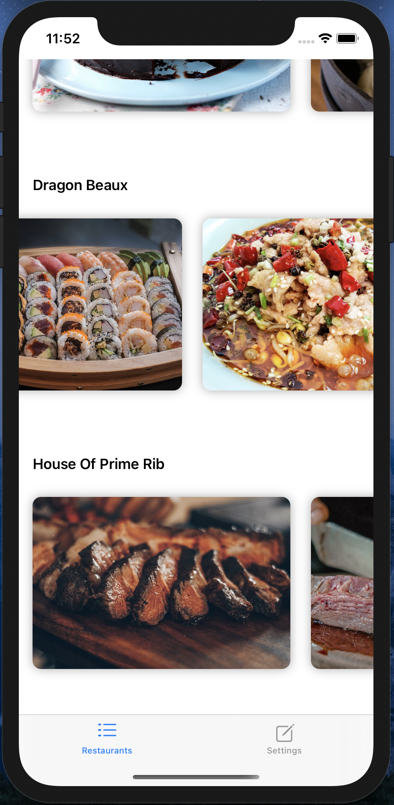
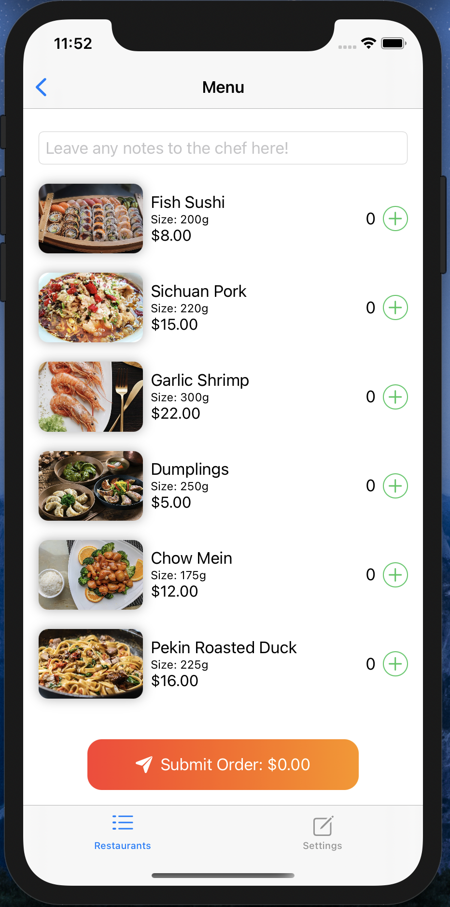
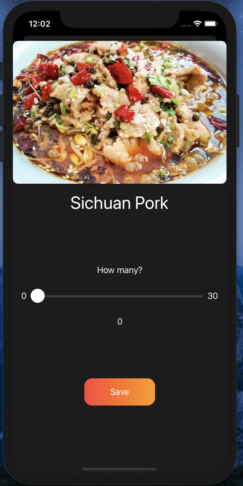

# CS193P (iOS Development) Final Project

This is the front-end code of an iOS food delivery demo app.

Main Page             |  Submit Order   | Dark Mode
:-------------------------:|:-------------------------:|:-------------------------:
  |   | 

You can watch a live demo [here](https://youtu.be/7aYsOE60TvM).

To run, open the `QuickFood.xcworkspace` file in Xcode.
